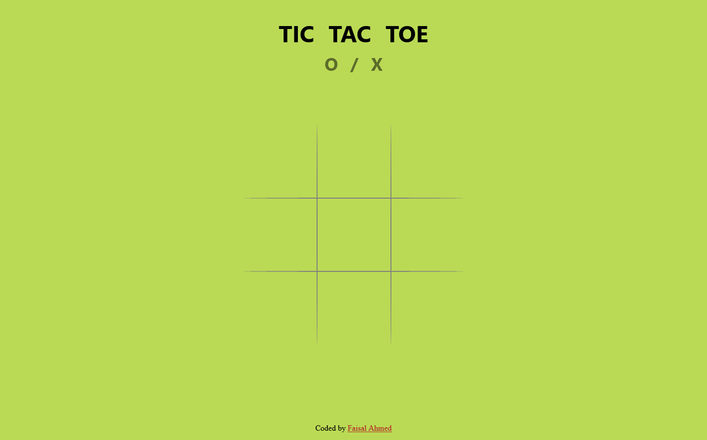
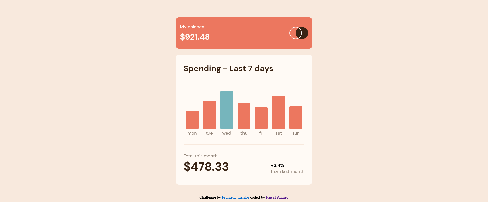
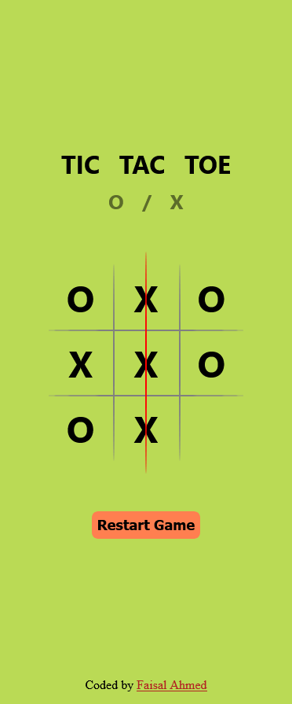

# Tic Tac Toe
A fun game to play.

## Table of contents

- [Overview](#overview)
- [Screenshot](#screenshot)
- [Links](#links)
- [My process](#my-process)
- [Built with](#built-with)
- [What I learned](#what-i-learned)
- [Continued development](#continued-development)
- [Useful resources](#useful-resources)
- [Author](#author)
- [Acknowledgments](#acknowledgments)

## Overview
This is simple and a nice looking tic tac toe game, with some animations and basic features.

### Screenshot

### Links
- Live Site URL: [https://tic-tac-toe.vercel.app/](https://tic-tac-toe.vercel.app/) 

### my-process
I have completed this project without using media queries at all and, I have used fluid font types and grid for game-board and I used some absolute lines for board decoration.
### what-i-learned

I learned how to used absolute elements for decorations and also using fluid font types. and for more or less a test of deep JS along with next.
### Built with

- Semantic HTML5 markup
- CSS custom properties
- SASS
- Flex-box
- Grid
- Mobile-first workflow
- [React](https://reactjs.org/) - JS library
- [Next.js](https://nextjs.org/) - React framework

## Author

- Twitter - [@FaisalAhmed_01](https://www.twitter.com/FaisalAhmed_01)

## Acknowledgments

<!-- I would like to thank Frontend Mentor Team, for being such an amazing platform and educating millions of students everyday with valuable resources without any cost.  -->
