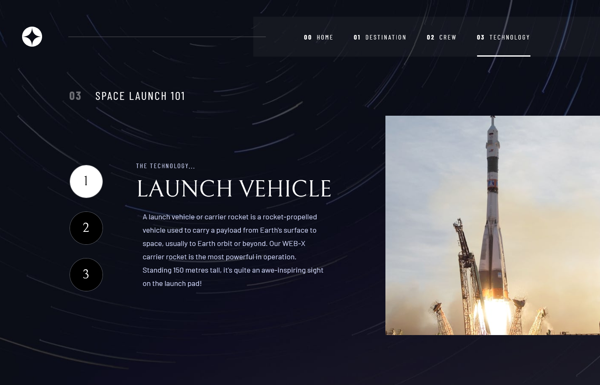
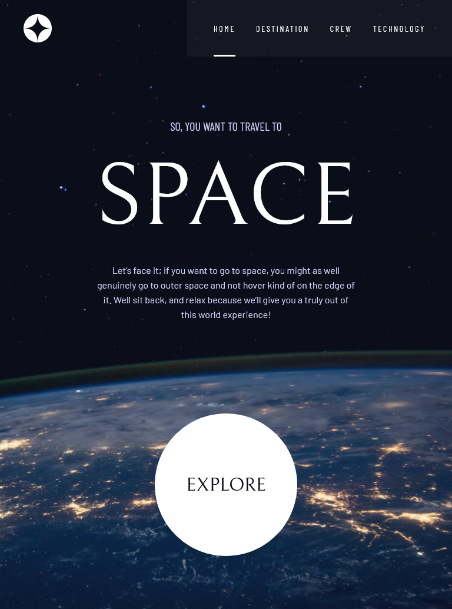
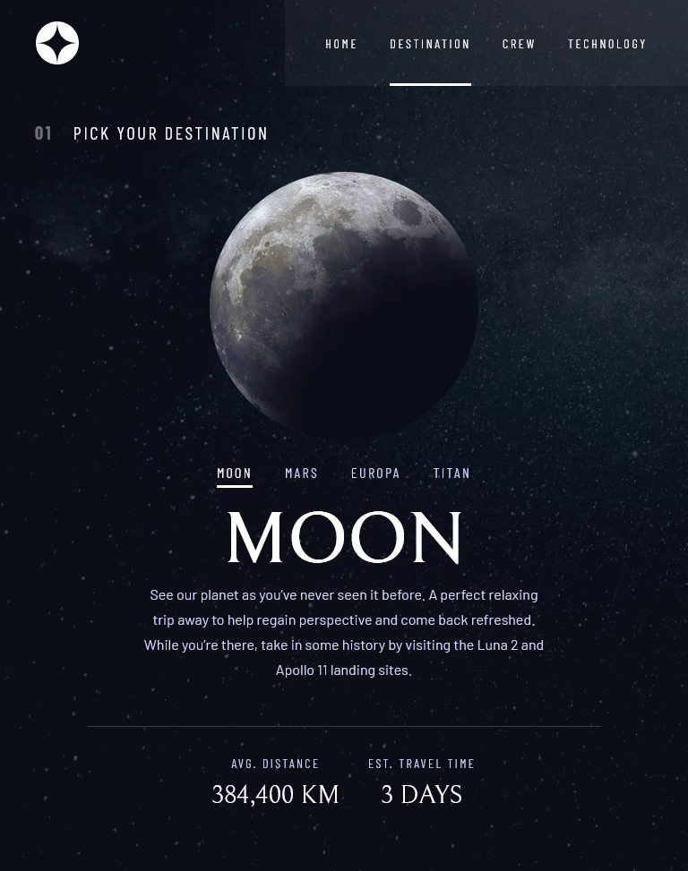
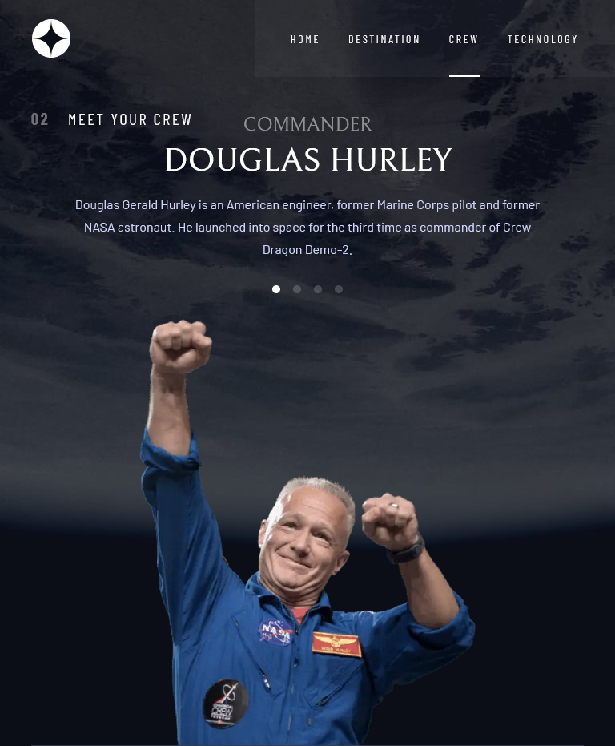
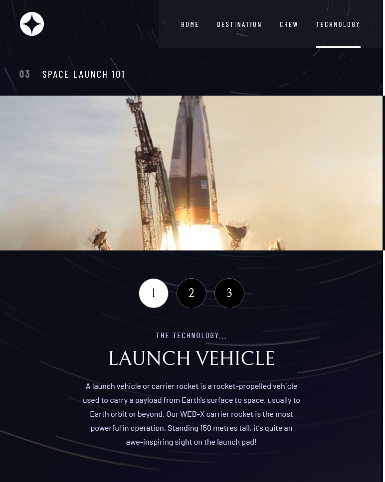
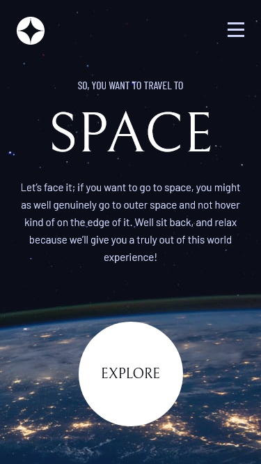
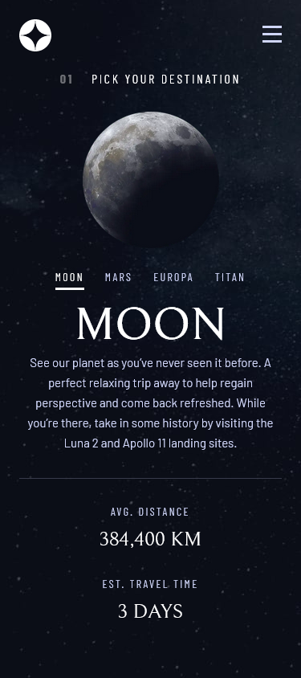
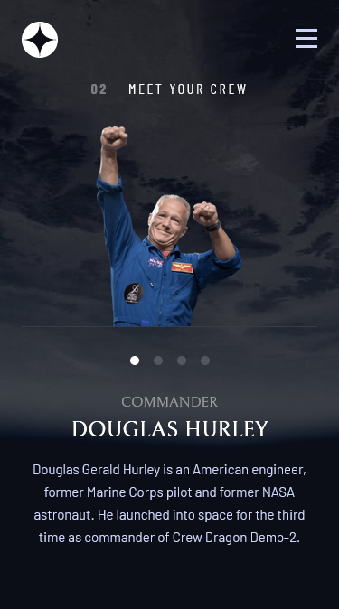
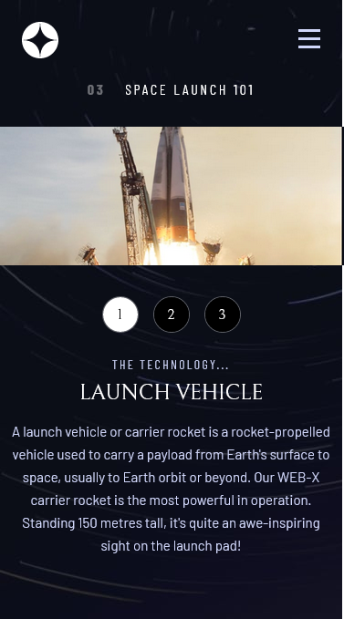

# Frontend Mentor - Space tourism website solution

This is a solution to the [Space tourism website challenge on Frontend Mentor](https://www.frontendmentor.io/challenges/space-tourism-multipage-website-gRWj1URZ3). Frontend Mentor challenges help you improve your coding skills by building realistic projects. 

## Table of contents

- [Overview](#overview)
- [Screenshot](#screenshot)
- [Links](#links)
- [My process](#my-process)
- [Built with](#built-with)
- [What I learned](#what-i-learned)
- [Continued development](#continued-development)
- [Useful resources](#useful-resources)
- [Author](#author)
- [Acknowledgments](#acknowledgments)

## Overview

This is my solution to Frontend mentor multipage Space tourism website . 

### Screenshot

### Links
- Live Site URL: [https://space-tourism-.vercel.app/](https://space-tourism.vercel.app/) 

### my-process
With Frontend learnings it became possible to complete this project, using HTML , Sass and JS, starting with layout of the app, then with HTML and JS I covered the rest of the project.

This challenge was more challenging then the rest of others I have done. I had to manage routing and state management, 

### what-i-learned

As you know, practice is the only way of getting hands on best practices, therefore as I practice, I learn how to practice more. How to write more clean and optimized code.

### Built with

- Semantic HTML5 markup
- CSS custom properties
- SASS
- Flex-box
- Grid
- Mobile-first workflow
- [React](https://reactjs.org/) - JS library
- [Next.js](https://nextjs.org/) - React framework

## Author

- Twitter - [@FaisalAhmed_01](https://www.twitter.com/FaisalAhmed_01)

## Acknowledgments

I would like to thank Frontend Mentor Team, for being such an amazing platform and educating millions of students everyday with valuable resources without any cost. 
